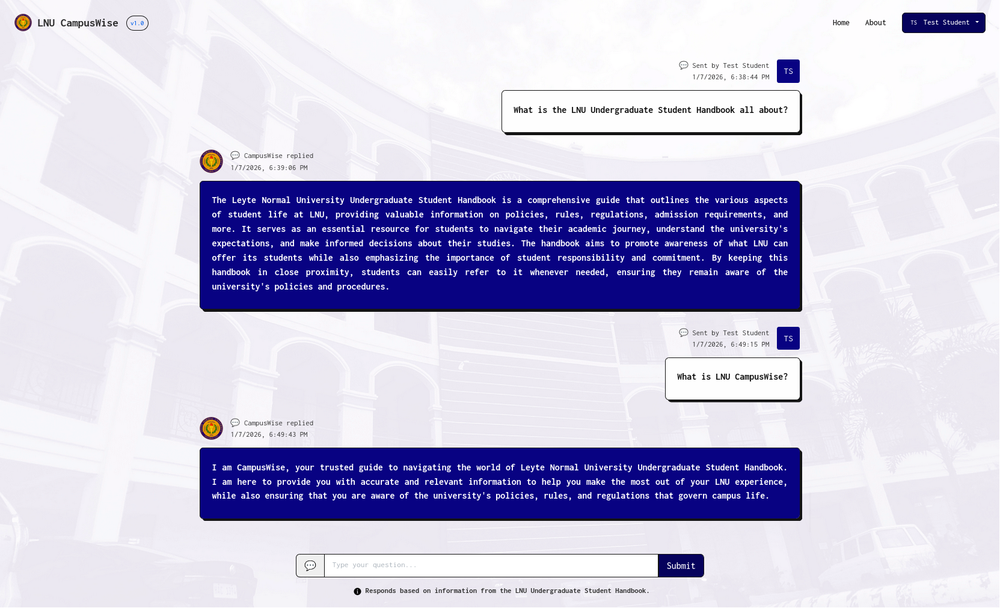

# 📘 CampusWise



**CampusWise** is a chatbot-based Student Manual system for undergraduate students of Leyte Normal University. It uses Retrieval-Augmented Generation (RAG) with Meta's llama3.2 LLM and LangChain to answer questions from the handbook via a web interface.

---

## 🚀 Features

- Retrieves relevant handbook content using document embeddings
- Answers user queries through Meta's **llama3.2** LLM
- Frontend chat interface served via **Nginx**
- Backend API built with **Express.js** using RAG chain
- Easy deployment via **Docker** and **docker-compose**

---

## 🧩 Project Structure

```
/
├── app/
│   └── chatbot/
│       ├── embeddings.js      ← embedding loader (OllamaEmbeddings + MemoryVectorStore)
│       ├── llms.js            ← ChatOllama model wrapper
│       ├── loader.js          ← document splitter loader
│       └── server.js          ← Express server with /chat endpoint
├── resources/                 ← images, icons
└── web/
    ├── html/                  ← chatbot.html, plus intro/login/register
    ├── css/                   ← chatbot.css and others
    └── js/                    ← chatbot.js (frontend logic)

```

---

## 🛠 Pre-requisites

1. Docker & Docker Compose
2. Ollama installed and models pulled:
    
    ```bash
    ollama pull llama3.2
    ollama pull mxbai-embed-large
    ```
    
3. (Optional) Local Node.js v22.x+ for development/test

---

## 🐳 Running With Docker Compose

In your project root, run:

```bash
docker-compose up --build
```

- Backend: [**http://localhost:3000**](http://localhost:3000/)
- Frontend: [**http://localhost:8080**](http://localhost:8080/)

This sets up three containers:

- **backend**: runs your Express server using Node.js
- **frontend**: serves static HTML/CSS/JS via Nginx
- **ollama**: hosts LLM API & serves pulled models

---

## 🔧 Development Setup (Without Docker)

1. Install Node.js 22.x+
    
    ```bash
    npm install
    ```
    
2. Run Ollama and pull models:
    
    ```bash
    ollama pull llama3.2
    ollama pull mxbai-embed-large
    ollama serve
    ```
    
3. Launch the backend server:
    
    ```bash
    node app/chatbot/server.js
    ```
    
4. Serve frontend files:
    
    Use VSCode Live Server or serve via Express
    
5. Visit:
    
    ```
    http://localhost:3000 => backend API
    http://localhost:3001/web/html/chatbot.html => frontend chat
    ```
    

---

## 💬 How It Works

1. **User** types a question → frontend sends it to `/chat` endpoint
2. **Server** performs similarity search on embeddings, retrieves top chunks
3. **RAG chain** passes query and context to LLM
4. **Server response** (JSON) with AI’s answer
5. **Frontend** appends the AI’s reply in chat UI

---

## ✅ Notes

- Ollama models are **mounted** in Docker via volume—no need to pull inside container
- The frontend JS (`web/js/chatbot.js`) handles user input, POSTs to `/chat`, and renders messages
- You can customize backend port or frontend routes in `docker-compose.yml`
- For final defense, highlight:
    - The RAG retrieval pipeline
    - Dockerized deployment for easy demonstration

---

## 🧑‍🏫 Credits

- **benny-18** – Development & design
- **hiyaranari** – Development & design
- **Leyte Normal University** – Handbook content
